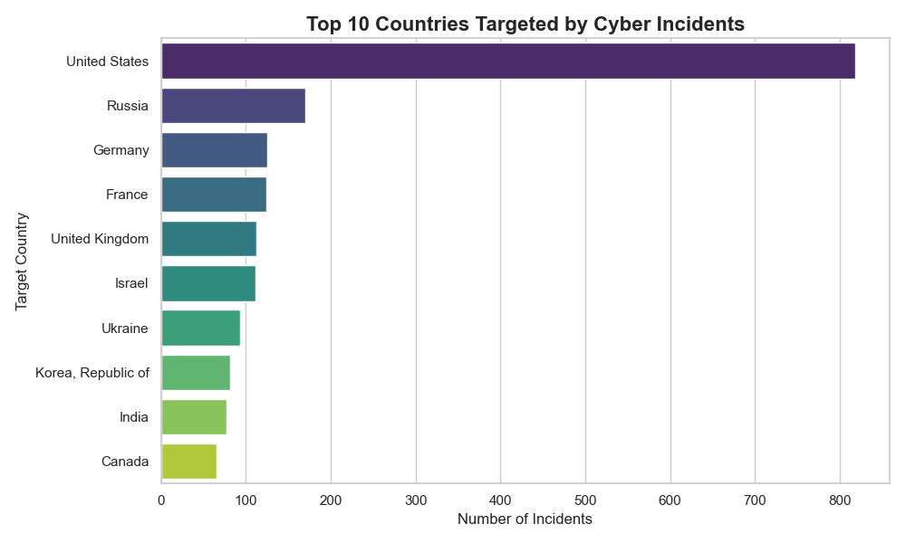
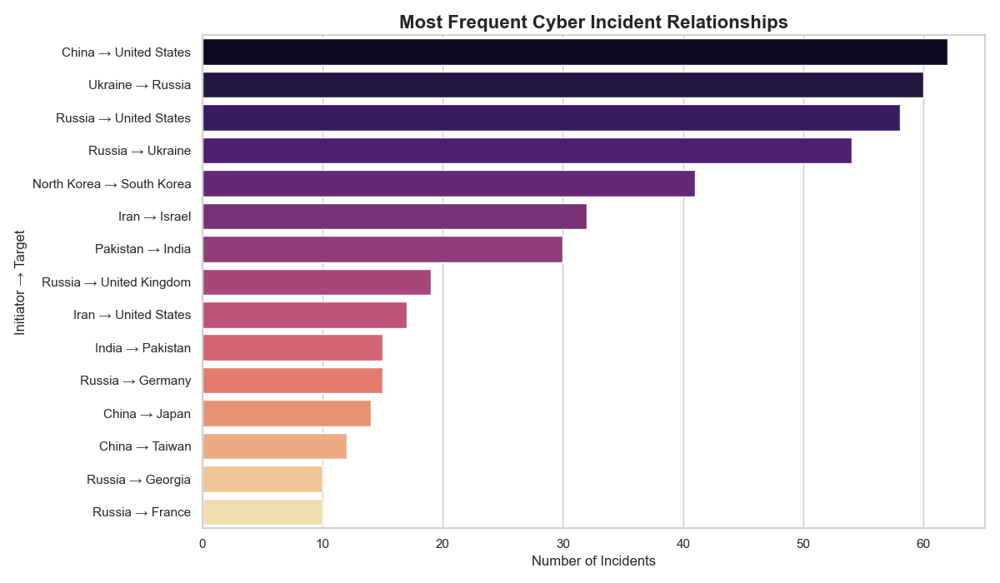
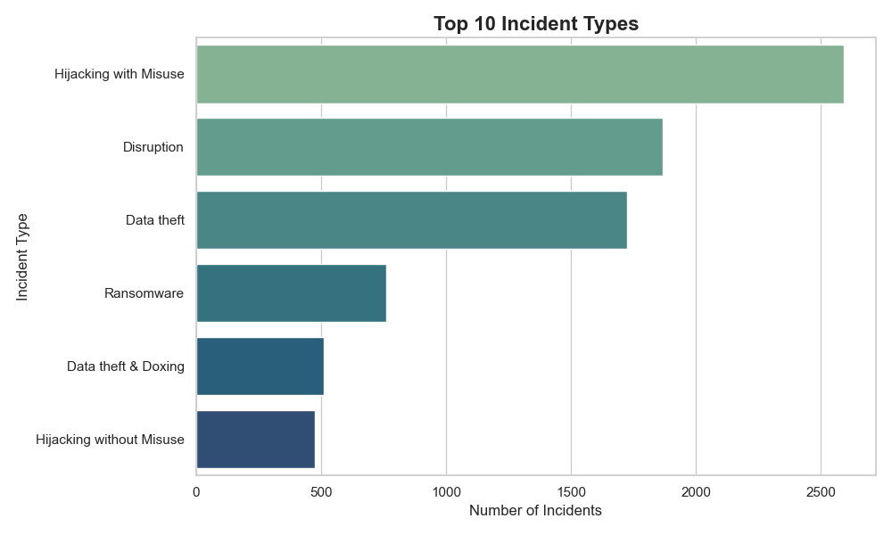
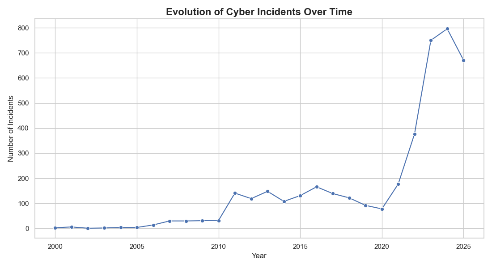

# COM-480 — Global Cybersecurity Incidents

## Dataset

This project uses the **EuRepoC Global Dataset of Cyber Incidents**, available at  
https://eurepoc.eu/table-view/.

The EuRepoC dataset is a curated database of real-world cyber operations compiled by cybersecurity researchers, containing over 4,000 documented cases worldwide. It documents cyber operations and significant cyber events involving governments, organizations, and infrastructure worldwide. Each row in the dataset corresponds to a documented cyber incident and includes detailed information about the actors involved, the targets, the type of cyber operation, and its potential impact.

The original dataset is relatively complex and contains **84 variables** describing different aspects of cyber incidents. These variables cover a wide range of information, including:

- general incident information (name, description, date)
- actors involved in the incident (initiator and receiver)
- geographic information (countries and regions)
- incident classification and attack techniques
- political, legal, and economic responses
- various impact indicators and metadata related to attribution and sources

While this richness makes the dataset valuable for research, many of these variables are **not directly relevant for exploratory visualization**. Several columns describe legal attribution processes, sanctions, metadata about sources, or other highly specialized attributes that would add unnecessary complexity to the visualization phase.

For this reason, we performed a **data selection step** to reduce the dataset to a smaller and more interpretable subset of variables. 
The following columns were retained:

- `start_date` – date of the cyber incident  
- `incident_type` – classification of the cyber incident  
- `receiver_country` – country of the targeted entity  
- `receiver_region` – geographic region of the target  
- `receiver_category` – type of target (government, organization, etc.)  
- `initiator_country` – country associated with the initiating actor  
- `initiator_category` – type of initiating actor  
- `data_theft` – indicator of whether data theft occurred  
- `has_disruption` – indicator of service disruption  
- `disruption` – additional disruption indicator  
- `hijacking` – indicator of hijacking activity  
- `economic_impact` – indicator of economic consequences  
- `impact_indicator_value` – quantitative indicator of the incident impact  

The resulting dataset is significantly **lighter and easier to interpret**, while still preserving the most important information needed to analyze global cyber incidents. It retains the key analytical dimensions required for visualization:

- **time** (when incidents occur)
- **geography** (where incidents occur)
- **actors** (who initiates and who is targeted)
- **incident characteristics**
- **impact indicators**

## Problematic

Cyber incidents have become an increasingly important component of international relations and digital security. Governments, organizations, and critical infrastructures around the world are frequently targeted by cyber operations ranging from espionage and data theft to service disruptions and politically motivated attacks. However, the global landscape of cyber incidents remains difficult to interpret due to the large number of actors involved, the diversity of targets, and the complexity of cyber operations.

Although many cyber incidents are documented publicly, the information is often scattered across reports, news articles, and security analyses. As a result, it is challenging to obtain a clear overview of **where cyber incidents occur, who initiates them, who is targeted, and what their impact is**.

The objective of this project is therefore to **explore and visualize the global dynamics of cyber incidents** using the EuRepoC dataset. By transforming structured incident-level data into interactive visualizations, we aim to make patterns and relationships within the cyber incident landscape easier to understand.

Through interactive visualizations, the project aims to answer questions such as:

- Which countries are most frequently targeted by cyber incidents?
- Which countries or actors are most often associated with initiating cyber operations?
- What types of cyber incidents occur most frequently?
- What kinds of impacts (e.g., disruption or data theft) are most common?

By presenting these patterns visually through an interactive web interface, the project seeks to provide a clearer and more intuitive understanding of the global cyber incident landscape. The target audience includes **students, researchers, cybersecurity analysts, and the general public** interested in exploring how cyber incidents are distributed across countries, actors, and sectors worldwide.

## Exploratory Data Analysis

To better understand the structure of the dataset and identify meaningful patterns, we conducted an exploratory analysis focusing on key dimensions of cyber activity: **the most frequently targeted countries**, **attacker–target relationships**, **incident types**, and **their evolution over time**.

### Most Targeted Countries

This visualization shows the **ten countries most frequently targeted by documented cyber incidents** in the dataset.

The **United States appears as the most targeted country by a large margin**, reflecting its role as a major geopolitical and technological actor as well as the concentration of large organizations and digital infrastructure. Several European countries such as **Germany, France, and the United Kingdom** also appear frequently among the targets, indicating that highly developed and digitally connected economies tend to attract significant cyber activity.

Countries involved in ongoing geopolitical tensions, such as **Ukraine and Israel**, are also present in the top targets. This highlights how cyber operations often accompany broader political or strategic conflicts.

### Most Frequent Attacker–Target Relationships

The second visualization explores the **most frequent relationships between initiating and targeted countries**. Each bar represents a pair composed of an initiating country and a targeted country.

Several clear geopolitical patterns emerge. The **China → United States** pair appears as the most frequent relationship in the dataset, followed by **Russia → United States** and **Russia → Ukraine**. These patterns reflect well-known cyber tensions between major global powers.

Regional rivalries are also visible. For example, the dataset highlights relationships such as **North Korea → South Korea**, **Iran → Israel**, **Pakistan → India**, and **Russia → Ukraine** which correspond to long-standing geopolitical tensions in different regions of the world.

### Most Frequent Incident Types

This visualization shows the **most common incident types** in the dataset. By separating combined labels into individual categories, it provides a clearer overview of the nature of cyber incidents. The chart shows that **Hijacking with Misuse, Disruption, and Data theft** are the most frequent categories, indicating that the dataset is largely dominated by incidents involving system misuse, operational disruption, and information theft.

### Time Evolution

This last visualization shows how the number of documented cyber incidents changes over time. It reveals a strong increase in the number of incidents, particularly from the 2010s onward, with a clear peak in recent years. This suggests that cyber incidents have become increasingly prominent, while also reflecting improved documentation and greater public reporting of such events.

## Related work

> - What others have already done with the data?

The EuRepoC project already provides several ways to explore the dataset online. Their platform includes an interactive table view and dashboard where users can filter incidents by country, actor, target, incident type, and time period. In practice, the original source supports detailed exploration of individual incidents and combinations of variables.

However, these interfaces are primarily designed for **database exploration** and **incident lookup**. While they are effective for querying specific cases, they do not emphasize a compact visual narrative that highlights the most important geopolitical patterns.

Our project builds on this dataset but aims to take a different approach: instead of focusing on detailed filtering, we will focus on **high-level visual summaries** that make the main structures of the dataset immediately understandable.

> - Why is your approach original?

Our approach differs from existing tools in that we do not aim to reproduce the EuRepoC interface. Instead, we will curate the dataset and focus on a limited number of analytical dimensions that are most relevant for visual storytelling: who is targeted, who initiates incidents, and which attacker–target relationships are most prominent.

The originality of our approach lies in three main choices:

- **Selection rather than exhaustiveness**: we will reduce the dataset to the dimensions that best reveal interpretable patterns  
- **Narrative visualization**: we will highlight recurring global structures such as dominant targets and geopolitical rivalries  
- **Accessibility**: we aim to design visualizations that are understandable to a broad audience, including non-specialists  

Therefore, the contribution of this project is not the creation of new data, but the development of a **clearer and more interpretable representation** of existing data.

> - What source of inspiration do you take? Visualizations that you found on other websites or magazines (might be unrelated to your data).

Our visual approach is inspired by data storytelling platforms such as *Our World in Data*, which emphasize clarity, simplicity, and accessibility for a wide audience.

We also draw inspiration from the **Financial Times Visual Vocabulary**, which promotes choosing visualization types based on the message rather than the data format.

These principles will guide our design choices, including:

- using sorted bar charts to clearly present rankings  
- favoring simple and readable visualizations over complex dashboards  
- pairing visualizations with short explanatory text to enhance interpretation  

Our objective is to follow an **editorial data storytelling approach**, focusing on clarity and communication rather than exhaustive exploration.

> - In case you are using a dataset that you have already explored in another context (ML or ADA course, semester project...), you are required to share the report of that work to outline the differences with the submission for this class.

This dataset has not been used in any previous coursework.

