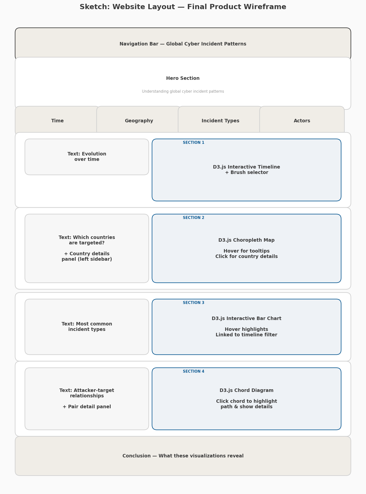
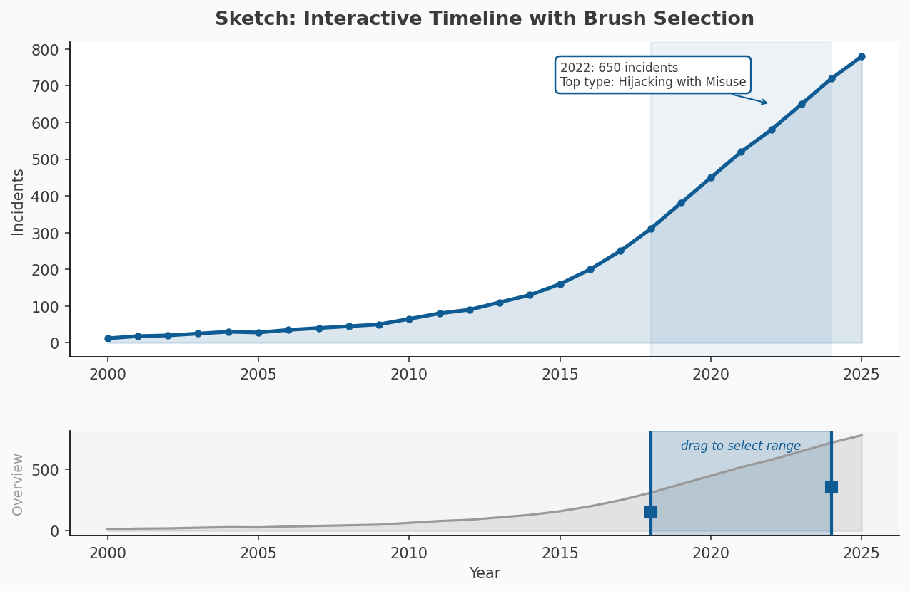
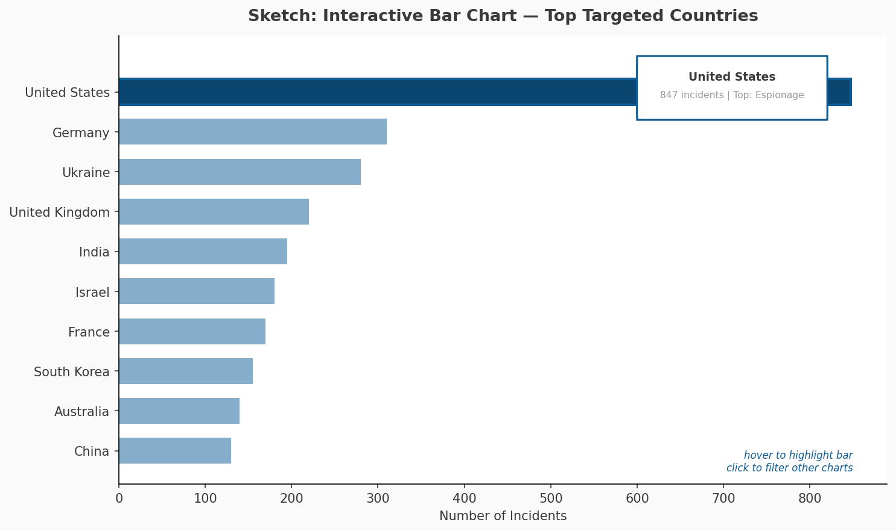
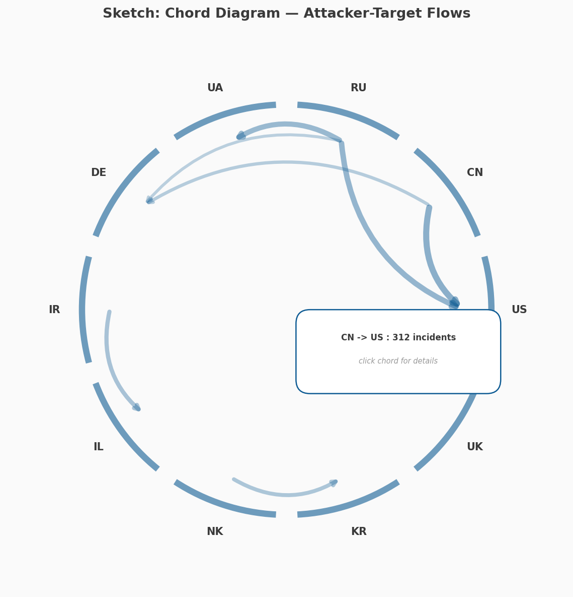
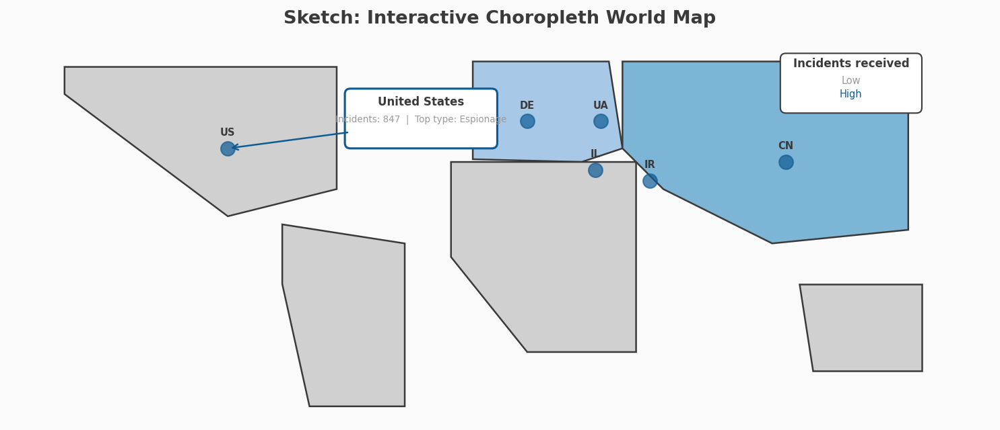

# Milestone 2 — Global Cybersecurity Incidents

## Project Goal

Cyber incidents have become one of the most important dimensions of international security, yet the data that documents them remains largely inaccessible to non-specialists. Repositories like EuRepoC collect thousands of records with rich attributes — dates, actors, targets, incident types, attribution details — but present them in tabular interfaces that are difficult to interpret at a glance. There is a gap between the data that exists and the understanding that the public, researchers, and policymakers actually need.

This project bridges that gap. The goal is to build an **interactive, narrative-driven website** that transforms the EuRepoC dataset (4,374 documented cyber operations, 211 countries, spanning 2000–2025) into a set of coordinated visualizations. Instead of exposing every available variable, the website focuses on **four analytical questions** that capture the most meaningful structures in the data:

1. **How have cyber incidents evolved over time?** A timeline reveals the sharp acceleration of recorded incidents in recent years — from fewer than 30 per year before 2010 to nearly 800 in 2024 — raising questions about whether this reflects a true increase in activity, an improvement in detection, or both.

2. **Which countries are targeted most often?** A ranked bar chart shows that cyber targeting is highly concentrated: the United States alone accounts for over 1,400 incidents, followed by Russia, Germany, and France. This makes geographic concentration immediately visible and invites comparison.

3. **What types of cyber incidents dominate?** A second bar chart ranks the most common forms of cyber activity. Hijacking with misuse, disruption, and data theft together account for the vast majority of incidents, while ransomware — despite its media prominence — is comparatively less frequent in state-level data.

4. **Which attacker–target relationships recur?** A relational chart maps the most frequent initiator–target country pairs, surfacing persistent geopolitical rivalries (China → United States, Russia → Ukraine) that are invisible in aggregated country-level statistics.

Each section of the website pairs a purpose-built visualization with a short explanatory text and a key-takeaway box, following a **scrollytelling** structure inspired by outlets like *Our World in Data* and the *Financial Times Visual Vocabulary*. The design prioritizes clarity, narrative, and accessibility: the audience includes students, cybersecurity analysts, policy researchers, and the general public.

The website skeleton is already functional (see the [Functional Prototype](#functional-prototype) section). For Milestone 3, the static prototype will be extended with richer interactivity — brush-based time filtering, cross-chart coordination, and potentially a choropleth world map — but the core structure and analytical logic are already in place.

---

## Visualization Sketches

The following wireframe sketches illustrate the visualizations planned for the final product.

### Overall Website Layout



The website follows a scrollytelling structure: a hero section introduces the project, followed by four analytical sections each pairing explanatory text (left) with a chart (right), and ending with a conclusion. A sticky navigation bar provides direct access to each section.

### Visualization 1 — Interactive Timeline with Brush Selection



A line chart showing incident counts per year (2000–2025). The current prototype renders this as an interactive D3.js line chart with hover tooltips showing the exact count per year. In the final version, a **brush selector** below the main chart will let users narrow the time window, and the selected range will filter the other charts.

### Visualization 2 — Top Targeted Countries



A horizontal bar chart ranking the top 10 targeted countries. The current prototype renders this as an interactive D3.js bar chart with animated bar transitions and hover tooltips. In the final version, clicking a bar could filter all other charts to show only incidents involving that country.

### Visualization 3 — Top Incident Types

Uses the same horizontal bar chart layout as Visualization 2. The current prototype is already interactive with D3.js. In the final version, this chart will respond to time-range selections from the timeline brush.

### Visualization 4 — Attacker–Target Relationships



Currently implemented as a horizontal bar chart showing the 12 most frequent initiator–target country pairs. In the final version, this could be upgraded to a **chord diagram** (see sketch above) for a more expressive representation of bilateral flows, where arc thickness encodes frequency and hovering a chord highlights the specific pair.

### World Map (Extra Idea)



An optional choropleth world map where each country is shaded by the number of incidents it received. Hovering shows a tooltip with the country name and incident count. This is not part of the current prototype but would add a geographic perspective that complements the ranked bar charts.

---

## Tools

| Visualization | Tools | Relevant Lectures |
|---|---|---|
| **Timeline (line chart)** | D3.js (v7), SVG, JavaScript | Data, D3.js, Interactions |
| **Top Targeted Countries (bar chart)** | D3.js (v7), SVG, JavaScript | D3.js, Marks & Channels |
| **Top Incident Types (bar chart)** | D3.js (v7), SVG, JavaScript | D3.js, Marks & Channels |
| **Attacker–Target Pairs (bar / chord)** | D3.js (v7), d3-chord (planned), SVG | Graphs, Interactions, More interactive D3 |
| **World Map (extra)** | D3.js (v7), d3-geo, TopoJSON (planned) | Maps, Practical maps. |
| **Website skeleton & styling** | HTML5, CSS3 (custom properties, grid, flexbox), vanilla JavaScript | Basic web dev, JavaScript, Storytelling |

---

## Implementation Breakdown

### Core Visualizations — Minimal Viable Product (MVP)

These components form the essential deliverable. Each is independent and can be developed in parallel.

| # | Component | Description | Status |
|---|---|---|---|
| 1 | **Website skeleton + navigation** | Sticky nav bar, hero section, four section containers with text + chart areas, conclusion, footer. Responsive layout. | Done |
| 2 | **Editorial design system** | Consistent cards, section tags, key-takeaway boxes, and a muted warm color palette. | Done |
| 3 | **Timeline chart** | Interactive D3.js line chart with area fill, data points, and hover tooltips showing year and count. | Done |
| 4 | **Top targeted countries chart** | Interactive D3.js horizontal bar chart with animated transitions and hover tooltips. | Done |
| 5 | **Top incident types chart** | Interactive D3.js horizontal bar chart with the same layout and interactions. | Done |
| 6 | **Attacker–target pairs chart** | Interactive D3.js horizontal bar chart showing the 12 most frequent country pairs. | Done |
| 7 | **Summary metrics row** | Four metric cards with key dataset statistics (time span, total incidents, countries, peak year). | Done |

### Enhancements — Extra Ideas

These additions improve the experience but can be dropped without losing the project's core meaning.

| # | Enhancement | Description | Difficulty |
|---|---|---|---|
| A | **Brush-based time filtering** | A brush widget below the timeline; dragging it updates other charts to the selected year range. | Medium |
| B | **Chord diagram** | Replace the attacker–target bar chart with a chord diagram for a more expressive view of bilateral flows. | Medium–Hard |
| C | **Choropleth world map** | A new map section where countries are colored by incident count, with hover tooltips and click-to-detail. | Medium–Hard |
| D | **Cross-chart filtering** | Clicking a bar or country filters all other visualizations via a shared event dispatcher. | Medium |
| E | **Animated transitions on scroll** | Charts animate into view when the user scrolls to each section (intersection observer). | Low |
| F | **Dark mode** | A theme toggle switching between light and dark palettes. | Low |

---

## Functional Prototype

The current prototype is available online:

[Live Demo](https://com-480-data-visualization.github.io/visec/src/)

The source code is located in the [`src/`](src/) directory.

You can run the project locally using a simple Python server:

```bash
cd src
python3 -m http.server 8080
```

### What is already working

- **Full website skeleton**: sticky navigation bar, hero section with project introduction, four analytical sections each with explanatory text and chart containers, conclusion section, and footer.
- **Responsive design**: the layout adapts to desktop, tablet, and mobile screen widths using CSS Grid and media queries.
- **Editorial design system**: consistent use of cards, section tags, key-takeaway boxes, and a muted warm color palette.
- **Four interactive D3.js charts**:
  1. **Timeline** — line chart with area fill, data points, and hover tooltips (year + count).
  2. **Top targeted countries** — horizontal bar chart with animated entry transitions and hover tooltips.
  3. **Top incident types** — horizontal bar chart with the same interactive features.
  4. **Attacker–target pairs** — horizontal bar chart showing the 12 most frequent country pairs.
- **Summary metrics row**: four cards showing key dataset statistics (time span, total incidents, number of countries, peak year).
- **Responsive redraw**: charts resize correctly when the browser window is resized.

### What will change for Milestone 3

The current charts will be extended with richer interactivity. The timeline will gain a brush selector that filters all other charts by time range. The attacker–target bar chart may be upgraded to a chord diagram. A choropleth world map could be added as a new section. Cross-chart filtering and scroll-triggered animations will be considered as enhancements, following the MVP-first strategy outlined above.
